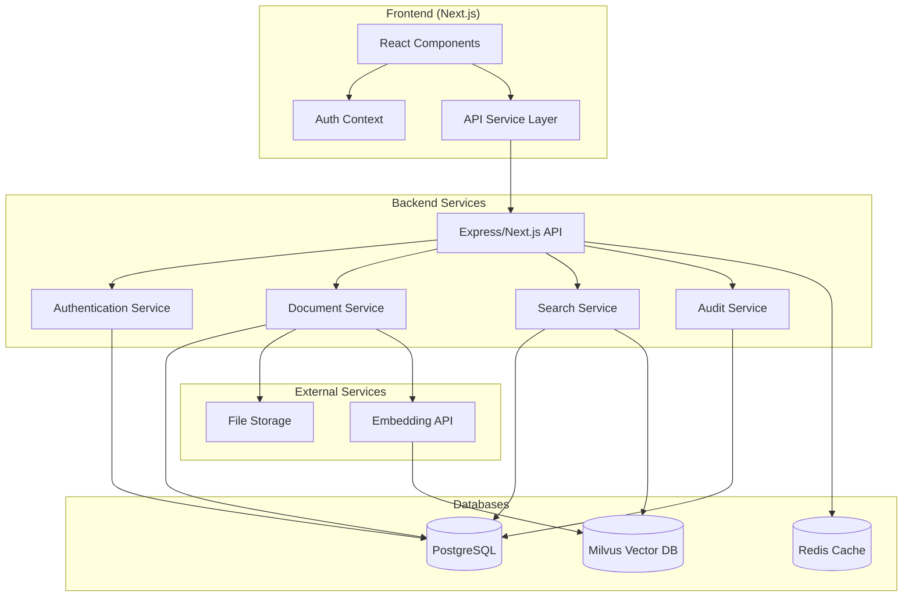

# Design Document

## Overview

This design document outlines the technical approach for enhancing the DocuMind AI document management platform with improved UI design, database integration, authentication system, and audit authorization features. The design transforms the current client-side application into a full-stack solution with PostgreSQL for metadata storage, Milvus for vector search, JWT-based authentication, and role-based access control.

## Architecture

### High-Level Architecture



### Technology Stack

- **Frontend**: Next.js 15, React 19, TypeScript, Tailwind CSS
- **Backend**: Next.js API Routes, Node.js
- **Databases**: PostgreSQL (metadata), Milvus (vectors), Redis (caching/sessions)
- **Authentication**: JWT tokens, bcrypt for password hashing
- **File Storage**: Local filesystem or cloud storage (S3-compatible)
- **Vector Embeddings**: OpenAI Embeddings API or local embedding model

## Components and Interfaces

### 1. UI Enhancement System

#### Color System Design
```typescript
// src/styles/theme.ts
export const theme = {
  colors: {
    primary: {
      50: '#eff6ff',
      100: '#dbeafe', 
      500: '#3b82f6',
      600: '#2563eb',
      700: '#1d4ed8',
      900: '#1e3a8a'
    },
    secondary: {
      50: '#f8fafc',
      100: '#f1f5f9',
      500: '#64748b',
      600: '#475569',
      700: '#334155',
      900: '#0f172a'
    },
    success: {
      50: '#f0fdf4',
      500: '#22c55e',
      600: '#16a34a'
    },
    warning: {
      50: '#fffbeb',
      500: '#f59e0b',
      600: '#d97706'
    },
    error: {
      50: '#fef2f2',
      500: '#ef4444',
      600: '#dc2626'
    }
  },
  spacing: {
    xs: '0.25rem',
    sm: '0.5rem',
    md: '1rem',
    lg: '1.5rem',
    xl: '2rem',
    '2xl': '3rem'
  },
  borderRadius: {
    sm: '0.25rem',
    md: '0.375rem',
    lg: '0.5rem',
    xl: '0.75rem'
  }
}
```

#### Component Design System
- **Button Component**: Consistent styling with variants (primary, secondary, danger)
- **Form Components**: Unified input, select, and textarea styling
- **Card Components**: Consistent container styling with shadows and borders
- **Navigation**: Enhanced sidebar and header with improved visual hierarchy
- **Status Indicators**: Color-coded status badges and progress indicators

### 2. Database Layer

#### PostgreSQL Schema Design

```sql
-- Users table
CREATE TABLE users (
    id UUID PRIMARY KEY DEFAULT gen_random_uuid(),
    email VARCHAR(255) UNIQUE NOT NULL,
    password_hash VARCHAR(255) NOT NULL,
    name VARCHAR(255) NOT NULL,
    department VARCHAR(100),
    role VARCHAR(50) DEFAULT 'staff' CHECK (role IN ('staff', 'manager', 'admin', 'auditor')),
    created_at TIMESTAMP DEFAULT CURRENT_TIMESTAMP,
    updated_at TIMESTAMP DEFAULT CURRENT_TIMESTAMP,
    last_login TIMESTAMP,
    is_active BOOLEAN DEFAULT true
);

-- Documents table
CREATE TABLE documents (
    id UUID PRIMARY KEY DEFAULT gen_random_uuid(),
    title VARCHAR(500) NOT NULL,
    filename VARCHAR(255) NOT NULL,
    file_path VARCHAR(1000) NOT NULL,
    file_type VARCHAR(50) NOT NULL,
    file_size BIGINT NOT NULL,
    uploaded_by UUID REFERENCES users(id),
    uploaded_at TIMESTAMP DEFAULT CURRENT_TIMESTAMP,
    updated_at TIMESTAMP DEFAULT CURRENT_TIMESTAMP,
    status VARCHAR(50) DEFAULT 'active' CHECK (status IN ('active', 'deleted', 'processing')),
    tags TEXT[],
    content_text TEXT,
    vector_id VARCHAR(255), -- Reference to Milvus vector
    metadata JSONB
);

-- Audit logs table
CREATE TABLE audit_logs (
    id UUID PRIMARY KEY DEFAULT gen_random_uuid(),
    user_id UUID REFERENCES users(id),
    action VARCHAR(100) NOT NULL,
    resource_type VARCHAR(50) NOT NULL,
    resource_id UUID,
    details JSONB,
    ip_address INET,
    user_agent TEXT,
    created_at TIMESTAMP DEFAULT CURRENT_TIMESTAMP
);

-- Sessions table (for JWT blacklisting)
CREATE TABLE user_sessions (
    id UUID PRIMARY KEY DEFAULT gen_random_uuid(),
    user_id UUID REFERENCES users(id),
    token_hash VARCHAR(255) NOT NULL,
    expires_at TIMESTAMP NOT NULL,
    created_at TIMESTAMP DEFAULT CURRENT_TIMESTAMP,
    is_active BOOLEAN DEFAULT true
);

-- Indexes for performance
CREATE INDEX idx_documents_uploaded_by ON documents(uploaded_by);
CREATE INDEX idx_documents_status ON documents(status);
CREATE INDEX idx_documents_uploaded_at ON documents(uploaded_at);
CREATE INDEX idx_audit_logs_user_id ON audit_logs(user_id);
CREATE INDEX idx_audit_logs_created_at ON audit_logs(created_at);
CREATE INDEX idx_audit_logs_action ON audit_logs(action);
```

#### Milvus Collection Schema

```typescript
// Vector collection configuration
const documentVectorCollection = {
  name: 'document_vectors',
  fields: [
    {
      name: 'id',
      data_type: DataType.VarChar,
      max_length: 36,
      is_primary_key: true
    },
    {
      name: 'document_id',
      data_type: DataType.VarChar,
      max_length: 36
    },
    {
      name: 'vector',
      data_type: DataType.FloatVector,
      dim: 1536 // OpenAI embedding dimension
    },
    {
      name: 'chunk_index',
      data_type: DataType.Int32
    },
    {
      name: 'content_snippet',
      data_type: DataType.VarChar,
      max_length: 1000
    }
  ]
}
```

### 3. Authentication System

#### JWT Token Structure
```typescript
interface JWTPayload {
  userId: string;
  email: string;
  role: 'staff' | 'manager' | 'admin' | 'auditor';
  department: string;
  iat: number;
  exp: number;
}
```

#### Authentication Service
```typescript
// src/services/auth.ts
export class AuthService {
  async login(email: string, password: string): Promise<AuthResult>
  async signup(userData: SignupData): Promise<AuthResult>
  async logout(token: string): Promise<void>
  async refreshToken(token: string): Promise<string>
  async validateToken(token: string): Promise<JWTPayload>
  async hashPassword(password: string): Promise<string>
  async verifyPassword(password: string, hash: string): Promise<boolean>
}
```

### 4. Document Management System

#### Document Service Interface
```typescript
// src/services/document.ts
export class DocumentService {
  async uploadDocument(file: File, metadata: DocumentMetadata, userId: string): Promise<Document>
  async getDocuments(userId: string, filters?: DocumentFilters): Promise<Document[]>
  async getDocument(id: string, userId: string): Promise<Document>
  async deleteDocument(id: string, userId: string): Promise<void>
  async updateDocument(id: string, updates: Partial<Document>, userId: string): Promise<Document>
  async generateEmbeddings(content: string): Promise<number[]>
  async storeVectors(documentId: string, vectors: VectorChunk[]): Promise<void>
}
```

### 5. Search System

#### Hybrid Search Implementation
```typescript
// src/services/search.ts
export class SearchService {
  async search(query: string, userId: string, options?: SearchOptions): Promise<SearchResult[]>
  async semanticSearch(query: string, userId: string): Promise<VectorSearchResult[]>
  async metadataSearch(query: string, userId: string, filters?: SearchFilters): Promise<Document[]>
  async combineResults(metadataResults: Document[], vectorResults: VectorSearchResult[]): Promise<SearchResult[]>
}
```

### 6. Audit System

#### Audit Service Interface
```typescript
// src/services/audit.ts
export class AuditService {
  async logAction(action: AuditAction): Promise<void>
  async getAuditLogs(filters: AuditFilters, userId: string): Promise<AuditLog[]>
  async checkAuditAccess(userId: string): Promise<boolean>
  async exportAuditLogs(filters: AuditFilters, userId: string): Promise<Buffer>
}
```

### 7. Role-Based Access Control (RBAC)

#### Role Definitions and Permissions

```typescript
// src/types/permissions.ts
export enum Permission {
  // Document permissions
  UPLOAD_DOCUMENT = 'upload_document',
  VIEW_OWN_DOCUMENTS = 'view_own_documents',
  VIEW_ALL_DOCUMENTS = 'view_all_documents',
  DELETE_OWN_DOCUMENTS = 'delete_own_documents',
  DELETE_ALL_DOCUMENTS = 'delete_all_documents',
  
  // Search permissions
  SEARCH_OWN_DOCUMENTS = 'search_own_documents',
  SEARCH_ALL_DOCUMENTS = 'search_all_documents',
  
  // User management permissions
  VIEW_USER_LIST = 'view_user_list',
  CREATE_USER = 'create_user',
  UPDATE_USER_ROLE = 'update_user_role',
  DEACTIVATE_USER = 'deactivate_user',
  
  // Audit permissions
  VIEW_BASIC_AUDIT = 'view_basic_audit',
  VIEW_DETAILED_AUDIT = 'view_detailed_audit',
  VIEW_FINANCIAL_AUDIT = 'view_financial_audit',
  EXPORT_AUDIT_LOGS = 'export_audit_logs',
  
  // System permissions
  MANAGE_SYSTEM_SETTINGS = 'manage_system_settings',
  VIEW_SYSTEM_METRICS = 'view_system_metrics'
}

export const ROLE_PERMISSIONS: Record<string, Permission[]> = {
  staff: [
    Permission.UPLOAD_DOCUMENT,
    Permission.VIEW_OWN_DOCUMENTS,
    Permission.DELETE_OWN_DOCUMENTS,
    Permission.SEARCH_OWN_DOCUMENTS
  ],
  
  manager: [
    Permission.UPLOAD_DOCUMENT,
    Permission.VIEW_OWN_DOCUMENTS,
    Permission.VIEW_ALL_DOCUMENTS,
    Permission.DELETE_OWN_DOCUMENTS,
    Permission.SEARCH_OWN_DOCUMENTS,
    Permission.SEARCH_ALL_DOCUMENTS,
    Permission.VIEW_USER_LIST,
    Permission.VIEW_BASIC_AUDIT
  ],
  
  admin: [
    Permission.UPLOAD_DOCUMENT,
    Permission.VIEW_OWN_DOCUMENTS,
    Permission.VIEW_ALL_DOCUMENTS,
    Permission.DELETE_OWN_DOCUMENTS,
    Permission.DELETE_ALL_DOCUMENTS,
    Permission.SEARCH_OWN_DOCUMENTS,
    Permission.SEARCH_ALL_DOCUMENTS,
    Permission.VIEW_USER_LIST,
    Permission.CREATE_USER,
    Permission.UPDATE_USER_ROLE,
    Permission.DEACTIVATE_USER,
    Permission.VIEW_BASIC_AUDIT,
    Permission.VIEW_DETAILED_AUDIT,
    Permission.EXPORT_AUDIT_LOGS,
    Permission.MANAGE_SYSTEM_SETTINGS,
    Permission.VIEW_SYSTEM_METRICS
  ],
  
  auditor: [
    Permission.VIEW_ALL_DOCUMENTS,
    Permission.SEARCH_ALL_DOCUMENTS,
    Permission.VIEW_USER_LIST,
    Permission.VIEW_BASIC_AUDIT,
    Permission.VIEW_DETAILED_AUDIT,
    Permission.VIEW_FINANCIAL_AUDIT,
    Permission.EXPORT_AUDIT_LOGS
  ]
};
```

#### Permission Checking Service
```typescript
// src/services/permissions.ts
export class PermissionService {
  static hasPermission(userRole: string, permission: Permission): boolean {
    const rolePermissions = ROLE_PERMISSIONS[userRole] || [];
    return rolePermissions.includes(permission);
  }
  
  static canAccessDocument(userRole: string, userId: string, documentOwnerId: string): boolean {
    if (this.hasPermission(userRole, Permission.VIEW_ALL_DOCUMENTS)) {
      return true;
    }
    
    if (this.hasPermission(userRole, Permission.VIEW_OWN_DOCUMENTS) && userId === documentOwnerId) {
      return true;
    }
    
    return false;
  }
  
  static canAccessAuditDetails(userRole: string, auditType: 'basic' | 'detailed' | 'financial'): boolean {
    switch (auditType) {
      case 'basic':
        return this.hasPermission(userRole, Permission.VIEW_BASIC_AUDIT);
      case 'detailed':
        return this.hasPermission(userRole, Permission.VIEW_DETAILED_AUDIT);
      case 'financial':
        return this.hasPermission(userRole, Permission.VIEW_FINANCIAL_AUDIT);
      default:
        return false;
    }
  }
}
```

#### Feature Access Matrix

| Feature | Staff | Manager | Admin | Auditor |
|---------|-------|---------|-------|---------|
| Upload Documents | ✅ | ✅ | ✅ | ❌ |
| View Own Documents | ✅ | ✅ | ✅ | ❌ |
| View All Documents | ❌ | ✅ | ✅ | ✅ |
| Delete Own Documents | ✅ | ✅ | ✅ | ❌ |
| Delete Any Documents | ❌ | ❌ | ✅ | ❌ |
| Search Own Documents | ✅ | ✅ | ✅ | ❌ |
| Search All Documents | ❌ | ✅ | ✅ | ✅ |
| View User List | ❌ | ✅ | ✅ | ✅ |
| Create/Manage Users | ❌ | ❌ | ✅ | ❌ |
| Basic Audit Logs | ❌ | ✅ | ✅ | ✅ |
| Detailed Audit Logs | ❌ | ❌ | ✅ | ✅ |
| Financial Audit Data | ❌ | ❌ | ✅ | ✅ |
| Export Audit Reports | ❌ | ❌ | ✅ | ✅ |
| System Settings | ❌ | ❌ | ✅ | ❌ |

#### Middleware for Permission Checking
```typescript
// src/middleware/permissions.ts
export const requirePermission = (permission: Permission) => {
  return (req: AuthenticatedRequest, res: Response, next: NextFunction) => {
    const userRole = req.user?.role;
    
    if (!userRole || !PermissionService.hasPermission(userRole, permission)) {
      return res.status(403).json({
        success: false,
        error: {
          code: 'INSUFFICIENT_PERMISSIONS',
          message: 'You do not have permission to access this resource'
        }
      });
    }
    
    next();
  };
};

export const requireDocumentAccess = () => {
  return (req: AuthenticatedRequest, res: Response, next: NextFunction) => {
    const { documentId } = req.params;
    const userId = req.user?.id;
    const userRole = req.user?.role;
    
    // This would typically fetch the document owner from the database
    // For now, we'll add it to the request context
    req.checkDocumentAccess = (documentOwnerId: string) => {
      return PermissionService.canAccessDocument(userRole!, userId!, documentOwnerId);
    };
    
    next();
  };
};
```

## Data Models

### Core Data Types

```typescript
// src/types/index.ts

export interface User {
  id: string;
  email: string;
  name: string;
  department: string;
  role: 'staff' | 'manager' | 'admin' | 'auditor';
  createdAt: Date;
  updatedAt: Date;
  lastLogin?: Date;
  isActive: boolean;
}

export interface Document {
  id: string;
  title: string;
  filename: string;
  filePath: string;
  fileType: string;
  fileSize: number;
  uploadedBy: string;
  uploadedAt: Date;
  updatedAt: Date;
  status: 'active' | 'deleted' | 'processing';
  tags: string[];
  contentText?: string;
  vectorId?: string;
  metadata?: Record<string, any>;
}

export interface AuditLog {
  id: string;
  userId: string;
  action: string;
  resourceType: string;
  resourceId?: string;
  details?: Record<string, any>;
  ipAddress?: string;
  userAgent?: string;
  createdAt: Date;
}

export interface SearchResult {
  document: Document;
  relevanceScore: number;
  snippet: string;
  matchType: 'metadata' | 'semantic' | 'hybrid';
}

export interface VectorChunk {
  id: string;
  documentId: string;
  vector: number[];
  chunkIndex: number;
  contentSnippet: string;
}
```

## Error Handling

### Simplified Error Handling

```typescript
// src/utils/errors.ts
export const handleError = (error: any, res: Response) => {
  console.error('Error:', error);
  
  if (error.message.includes('authentication')) {
    return res.status(401).json({ error: 'Authentication failed' });
  }
  
  if (error.message.includes('permission')) {
    return res.status(403).json({ error: 'Access denied' });
  }
  
  return res.status(500).json({ error: 'Something went wrong' });
};
```

## Prototype Testing

### Basic Testing Approach
- **Manual Testing**: Primary method for validating functionality
- **Component Testing**: Basic React component rendering tests
- **API Testing**: Simple endpoint validation
- **Database Testing**: Basic CRUD operation verification

### Focus Areas for Demonstration
- **Authentication Flow**: Login/signup functionality
- **Role-Based Access**: Different user role experiences
- **Document Management**: Upload, view, search capabilities
- **Audit Features**: Admin vs staff access differences

## Prototype Considerations

### Simplified Authentication
- Basic password hashing with bcrypt
- JWT tokens with reasonable expiration (24 hours)
- Simple logout functionality
- Basic input validation

### Role-Based Access (Prototype Level)
- Simple role checking for feature access
- Basic permission validation
- Demonstration of audit access control
- Minimal input sanitization for core functionality

### Data Handling
- Standard database connections
- Basic file upload handling
- Simple query structure
- Essential error handling

## Prototype Performance

### Basic Optimization
- Essential database indexes for core queries
- Simple connection management
- Basic pagination for document lists
- Standard React optimization patterns

### Demonstration Focus
- Responsive UI interactions
- Reasonable search response times
- Smooth navigation between features
- Clear loading states for user feedback

## Deployment Architecture

### Prototype Configuration
```typescript
// Simple environment setup
export const config = {
  database: {
    postgres: {
      host: process.env.POSTGRES_HOST || 'localhost',
      port: 5432,
      database: process.env.POSTGRES_DB || 'documind',
      username: process.env.POSTGRES_USER || 'postgres',
      password: process.env.POSTGRES_PASSWORD || 'password'
    },
    milvus: {
      host: process.env.MILVUS_HOST || 'localhost',
      port: 19530
    }
  },
  auth: {
    jwtSecret: process.env.JWT_SECRET || 'demo-secret-key',
    jwtExpiration: '24h'
  },
  storage: {
    path: './uploads',
    maxFileSize: 10485760 // 10MB
  }
};
```

### Development Setup
- Local PostgreSQL instance
- Local Milvus instance (Docker)
- Simple file storage in uploads directory
- Basic environment variables for configuration